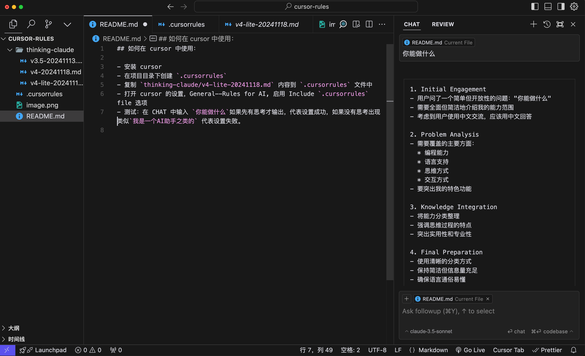
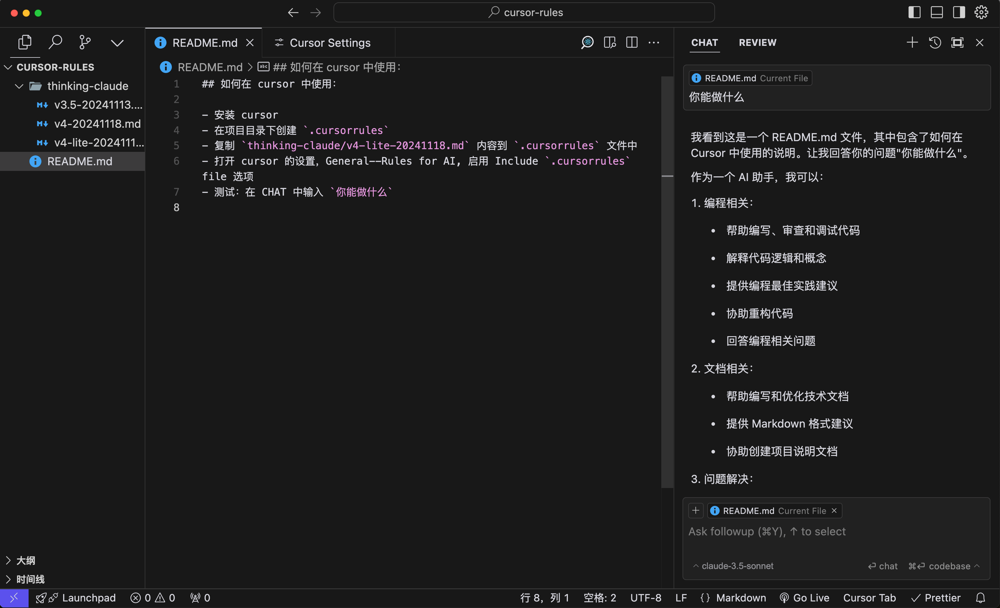

# Cursor Thinking Protocol 集成指南 🤖

这个项目帮助你在 Cursor 编辑器中集成 Claude 的思考协议，让 AI 助手能够展现出更深入的思考过程。

## ✨ 功能特点

- 启用 Claude 的详细思考过程
- 提供更深入的问题分析
- 生成更有质量的回答

## 🚀 安装配置

1. 首先确保已安装 [Cursor 编辑器](https://cursor.sh/)

2. 配置思考协议:

   - 在项目根目录创建 `.cursorrules` 文件
   - 将 `thinking-claude/v4-lite-20241118.md` 的内容复制到 `.cursorrules` 文件中

3. 启用配置:
   - 打开 Cursor 设置
   - 找到 `General → Rules for AI`
   - 勾选 `Include .cursorrules file` 选项

## 🔍 验证配置

在 CHAT 中输入 `你能做什么` 测试配置是否生效:

### ✅ 成功示例

- ✓ AI 会先展示思考过程
- ✓ 然后再给出具体回答

### ❌ 失败示例

- ✗ AI 直接回答"我是一个 AI 助手"等内容
- ✗ 没有展示思考过程
  

## 💡 常见问题

1. **文件配置**

   - `.cursorrules` 文件是否在正确位置
   - 文件内容是否完整复制

2. **Cursor 设置**
   - Rules for AI 选项是否正确启用
   - Cursor 是否为最新版本

## 📝 注意事项

- 确保使用最新版本的 Cursor
- 思考协议文件会定期更新，请留意新版本

## 🔗 相关链接

- [Cursor 官网](https://cursor.sh/)
- [更多配置](https://cursor.directory/)
- [项目 GitHub 仓库](#)

## ✨ 致谢

感谢 [richards199999](https://github.com/richards199999/Thinking-Claude) 提供的思考协议，让 AI 助手能够展现出更深入的思考过程。
