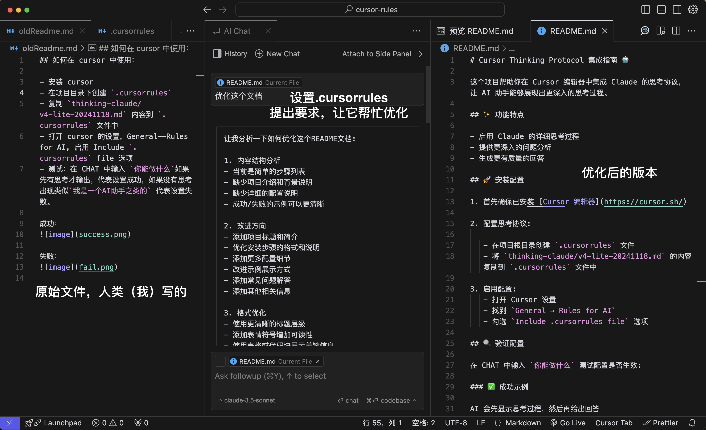

# Cursor Thinking Protocol Integration Guide 🤖

This project helps you integrate Claude's thinking protocol in Cursor editor, enabling AI assistants to demonstrate more in-depth thinking processes.

## ✨ Features

- Enable Claude's detailed thinking process
- Provide deeper problem analysis
- Generate higher quality responses

## 🤖 Supported Models

### Claude

- Supported versions: Claude 2.0, Claude 3 Sonnet/Opus
- Config file: `thinking-claude/v4-lite-20241118.md`
- Features:
  - Deep thinking chain display
  - Structured reasoning process
  - Multi-language support
  - Strong code analysis capabilities

### Qwen

- Supported versions: Qwen-7B, Qwen-14B
- Config file: `thinking-qwen/20241119.md`
- Features:
  - Optimized Chinese thinking chain
  - Concise thinking display
  - Suitable for Chinese users
  - Fast response speed

### Usage Recommendations

- For English programming tasks, Claude is recommended
- For Chinese interactions, Qwen can be chosen
- Switch between different models based on specific scenarios
- Keep model configuration files updated to the latest version

## 🚀 Installation & Configuration

1. First ensure [Cursor Editor](https://cursor.sh/) is installed

2. Configure thinking protocol:

   - Create `.cursorrules` file in project root directory
   - Copy contents of `thinking-claude/v4-lite-20241118.md` into `.cursorrules` file

3. Enable configuration:
   - Open Cursor settings
   - Find `General → Rules for AI`
   - Check `Include .cursorrules file` option

## 🔍 Verify Configuration

Test if configuration is working by typing `What can you do` in CHAT:

### ✅ Success Example

- ✓ AI will first show thinking process
- ✓ Then provide specific answers

### ❌ Failure Example

- ✗ AI directly answers "I am an AI assistant" etc.
- ✗ No thinking process displayed

## 🎉 Effect Demonstration

## 💡 FAQ

1. **File Configuration**

   - Is `.cursorrules` file in correct location
   - Is file content completely copied

2. **Cursor Settings**
   - Is Rules for AI option properly enabled
   - Is Cursor the latest version

## 📝 Notes

- Ensure using latest version of Cursor
- Thinking protocol files are updated regularly, please check for new versions

## 🔗 Related Links

- [Cursor Official Website](https://cursor.sh/)
- [More Configurations](https://cursor.directory/)
- [Get 20M Free Tokens](https://cloud.siliconflow.cn/i/h5JiyFm0)

## ✨ Acknowledgments

Thanks to [richards199999](https://github.com/richards199999/Thinking-Claude) for providing the thinking protocol, enabling AI assistants to demonstrate more in-depth thinking processes.
